# Lotto645 Lab

로또 6/45 번호 생성 및 데이터 분석 앱 — **당첨을 예측하는 앱이 아니라, 무작위성과 확률 개념을 정직하게 체험·학습하는 앱**입니다.

> 실제 당첨을 예측하는 기능이 아니라 무작위성 학습·데이터 분석·재미 목적입니다.
> 매크로/자동 구매 기능은 포함하지 않습니다.

## 데모 영상

실제 앱 화면을 녹화한 영상입니다 (음성 없음, 자막 포함). 썸네일을 클릭하면 mp4 파일이 열립니다.

| 강조 영상 (차별점) | 기능 소개 영상 |
|---|---|
| [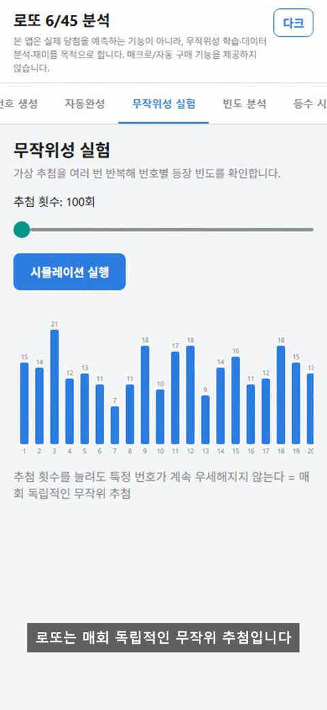](docs/videos/emphasis.mp4) | [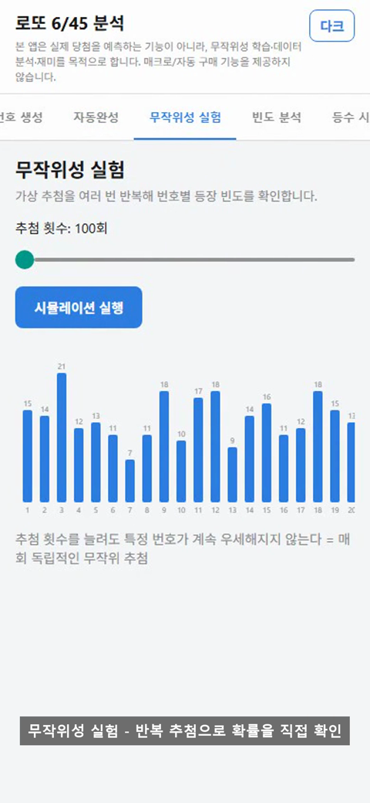](docs/videos/features_walkthrough.mp4) |

## 왜 이름이 "6/45"인가요?

"로또 6/45"는 저희가 지은 이름이 아니라, **동행복권이 운영하는 대한민국 공식 로또 게임의 실제 명칭**입니다.
1부터 45까지의 숫자 중 **6개**를 고르는 방식이라서 "6개 / 45개 중" → **6/45**라고 부릅니다.
그래서 이 게임을 다루는 모든 서비스가 관례적으로 "로또 6/45"라는 표기를 사용합니다.

## 이 프로젝트의 차별점

시중의 "로또 번호 생성기" 앱 대부분은 번호 생성·당첨 결과 조회 같은 기능은 이미 비슷하게 제공하지만,
"과거 통계를 반영해 당첨 확률을 높여준다"는 식으로 마케팅하는 경우가 많습니다.

이 프로젝트는 반대로,

- **무작위성 실험 탭**으로 "추첨 횟수를 아무리 늘려도 특정 번호가 우세해지지 않는다"는 걸 직접 시뮬레이션으로 보여주고,
- **AI 추천 조합 탭**에도 "실제 당첨 확률을 높이지 않는다"는 문구를 항상 고정 노출하며,
- 앱 전체 어디에도 "예측"이라는 단어를 쓰지 않고, 매크로/자동 구매 기능을 넣지 않는 것을 원칙으로 합니다.

즉, **"당첨 확률을 높여준다"가 아니라 "로또가 왜 예측 불가능한지"를 체험시키는 데 초점을 맞춘 앱**입니다.

## 기능 (탭 7개)

데스크탑 프로토타입(Python) 실행 화면 기준 스크린샷입니다.

### 1. 번호 생성
1~45 중 중복 없이 6개를 무작위로 뽑습니다. "많이 겹치는 조합 피하기" 옵션으로 31 이하 숫자가 5개 이상인 조합을 제외할 수 있습니다.

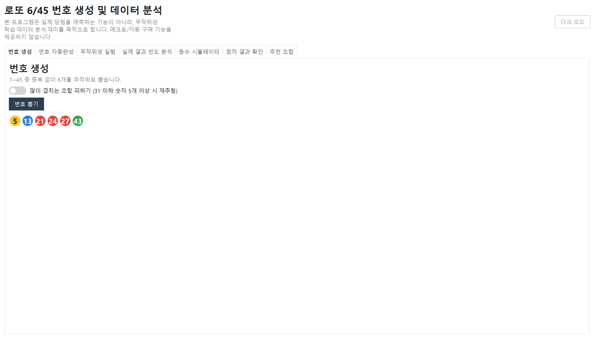

### 2. 번호 자동완성
원하는 번호를 1~5개 직접 고르면, 나머지를 무작위로 채워 6개를 완성합니다. 직접 선택/자동완성 번호가 테두리 색으로 구분됩니다.

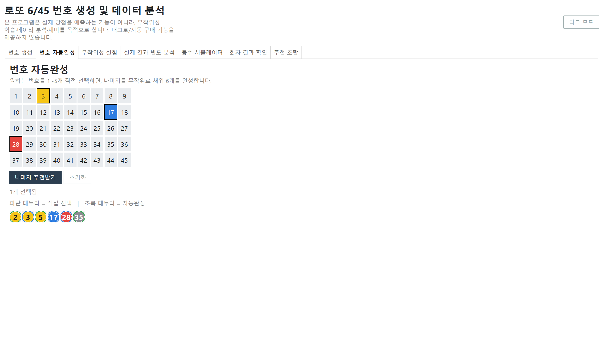

### 3. 무작위성 실험
100~100,000회 가상 추첨을 반복해 번호별 등장 빈도를 막대그래프로 보여줍니다. 횟수를 늘려도 특정 번호가 우세해지지 않는다는 걸 직접 확인할 수 있습니다.

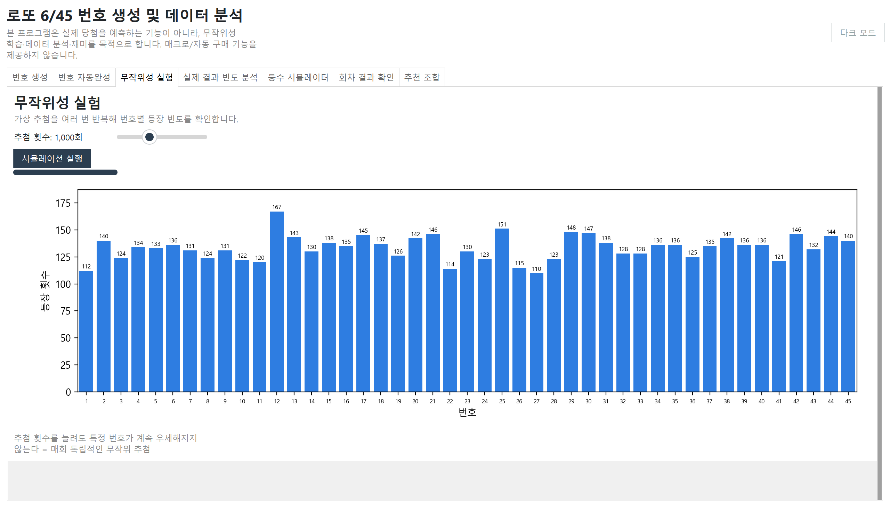

### 4. 실제 결과 빈도 분석
동행복권 공식 API로 원하는 회차·날짜 범위의 실제 당첨번호를 수집해 번호별 빈도(상위/하위 10개 포함)를 분석합니다.

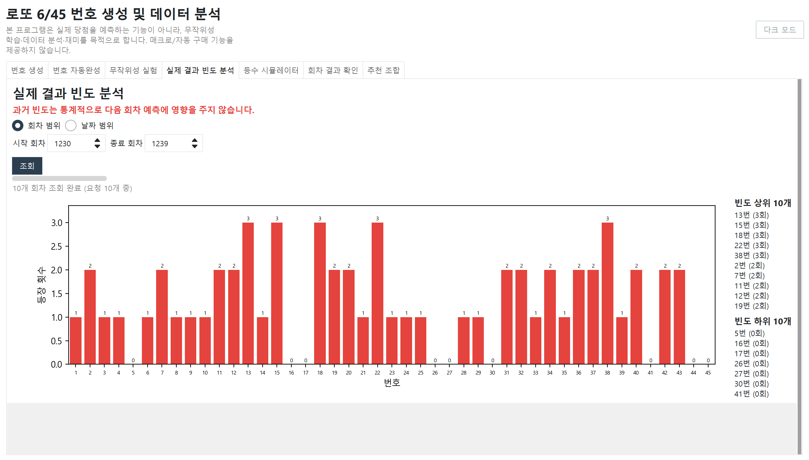

### 5. 등수 시뮬레이터
"당첨번호 재추첨"으로 가상 당첨번호를 뽑고, 원하는 번호 6개를 직접 골라 "결과 확인"을 누르면 몇 등인지 판정합니다. 당첨번호는 결과 확인 전까지 공개되지 않습니다.

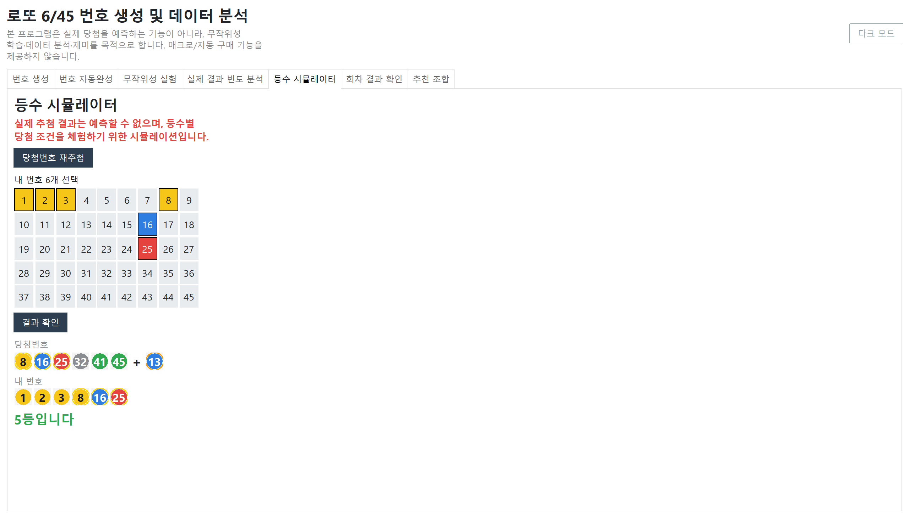

### 6. 회차 결과 확인
원하는 회차를 선택하고 번호 6개를 직접 고르면, 실제 당첨번호와 비교해 등수를 판정합니다.

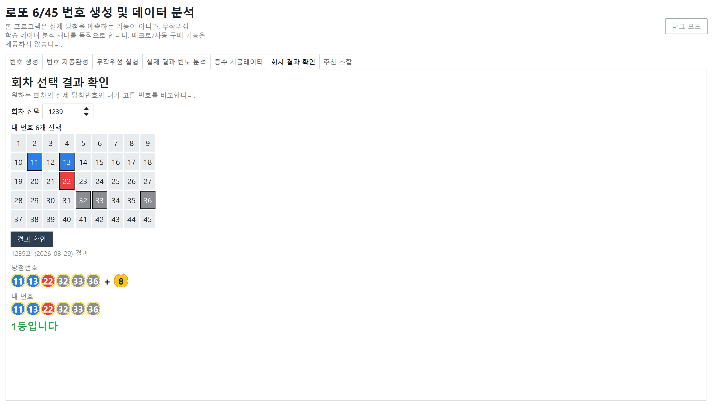

### 7. 추천 조합 (재미용)
최근 회차 통계·구간 분산·연속번호 제한 등 규칙을 조합해 번호를 생성합니다. "실제 당첨 확률을 높이지 않는다"는 문구가 항상 함께 표시됩니다.

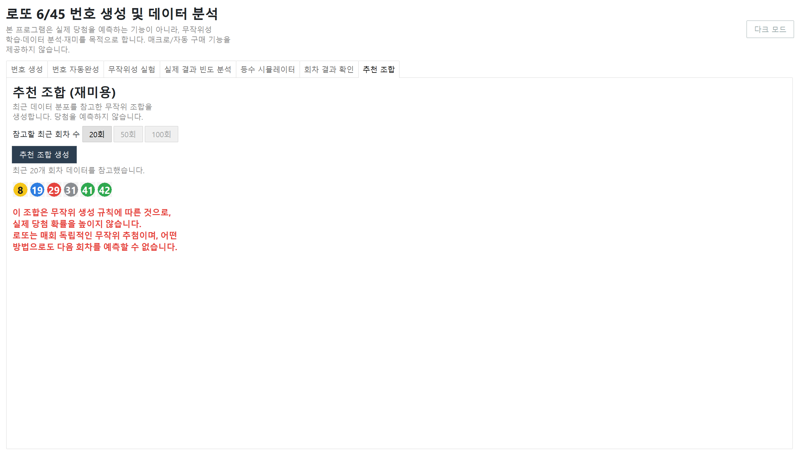

## 모바일 앱 화면 (React Native)

같은 기능을 React Native(Expo)로 구현한 모바일 앱 화면입니다.

<table>
<tr>
<td>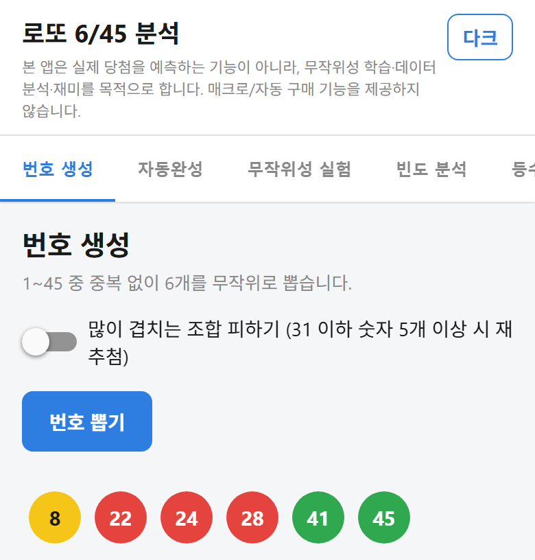</td>
<td>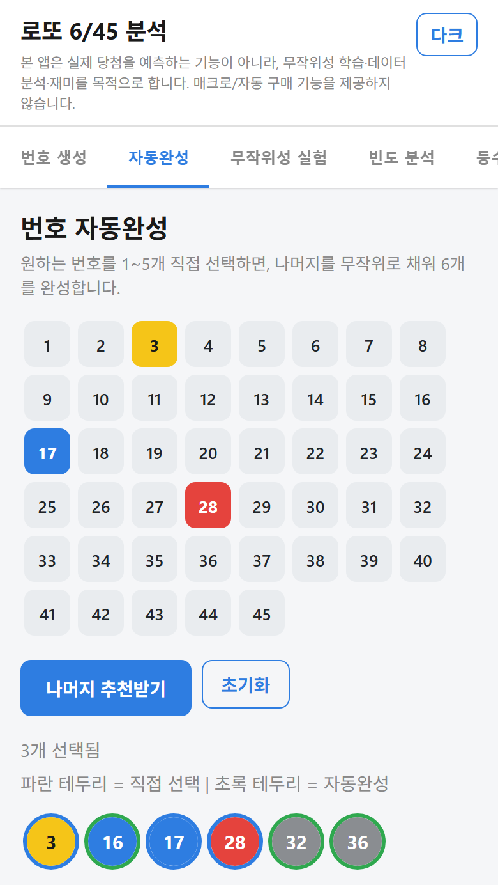</td>
<td>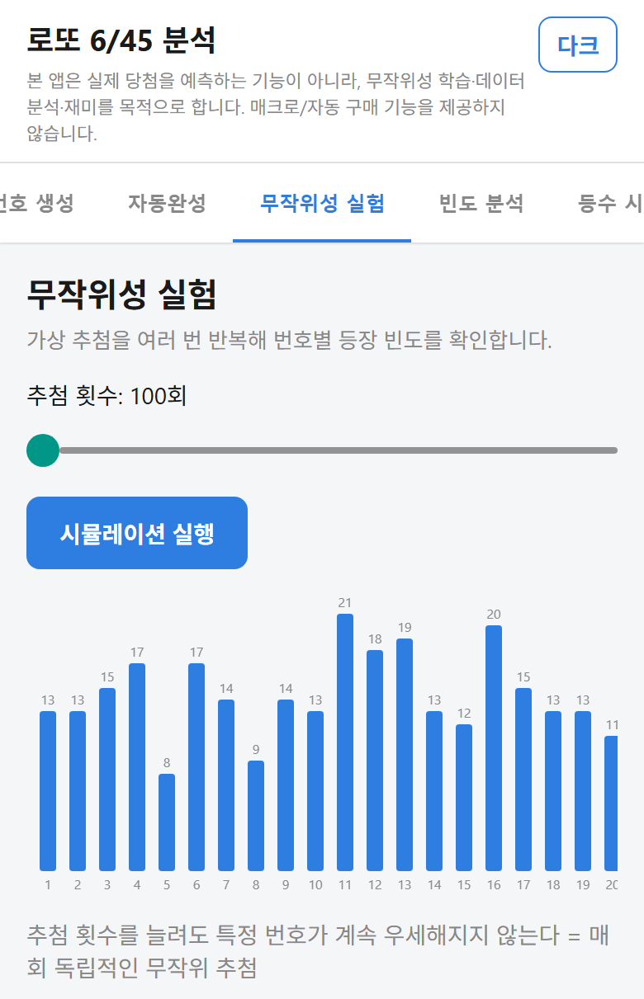</td>
<td>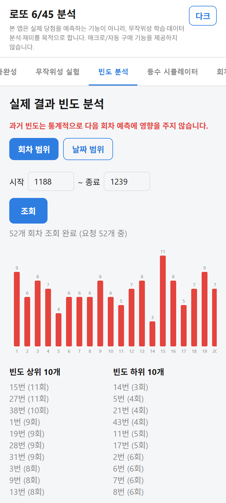</td>
</tr>
<tr>
<td>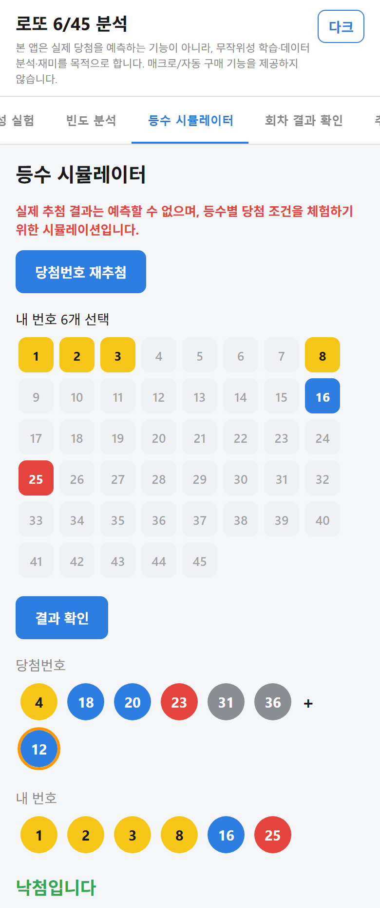</td>
<td>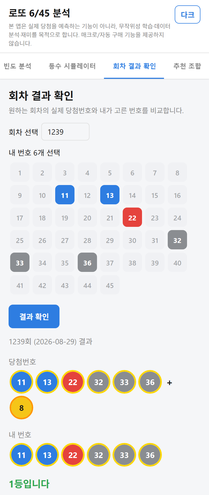</td>
<td>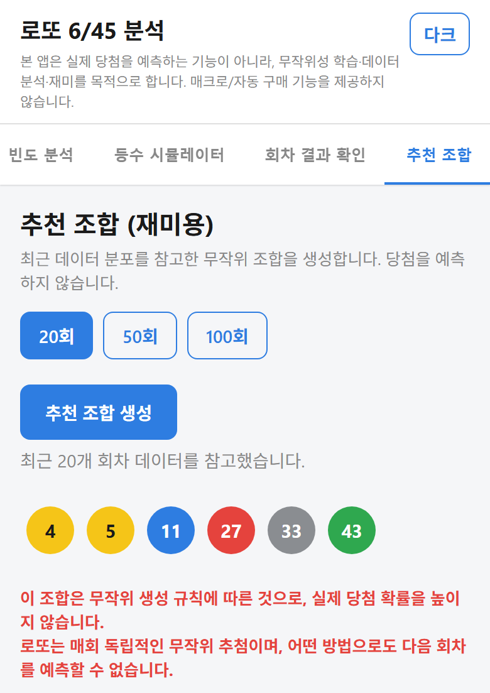</td>
<td></td>
</tr>
</table>

## 프로젝트 구조

이 저장소는 하나의 기능을 **두 가지 형태**로 구현합니다.

```
Lotto645Analyzer/
├── main.py, ui/, lotto/     # ① 데스크탑 프로토타입 (Python + Tkinter/ttkbootstrap)
│                              PC에서 기능/로직을 빠르게 검증하기 위한 버전
└── mobile/                  # ② 모바일 앱 (React Native + TypeScript, Expo)
    └── src/lotto/             실제 Play Store 배포를 목표로 하는 버전
```

두 버전 모두 등수 판정, 번호 생성, 동행복권 API 연동 같은 핵심 로직을 각 언어(Python / TypeScript)로 동일하게 구현합니다.

## 실행 방법

### 데스크탑 프로토타입 (Python)

```bash
python -m venv venv
venv\Scripts\activate
pip install -r requirements.txt
python main.py
```

### 모바일 앱 (React Native / Expo)

```bash
cd mobile
npm install
npx expo start
```

## 참고

- 회차별 당첨결과는 동행복권 공식 API(`dhlottery.co.kr/lt645/selectPstLt645InfoNew.do`)를 호출합니다. 한 번 호출하면 요청 회차를 포함한 최근 10개 회차를 함께 받아와 로컬 캐시에 저장하므로, 연속된 회차를 조회할수록 API 호출 수가 줄어듭니다.
- 인터넷 연결이 없으면 "실제 결과 빈도 분석" / "회차 결과 확인" / "추천 조합" 탭의 실데이터 조회 기능은 동작하지 않습니다 (그 외 탭은 오프라인에서도 동작).
